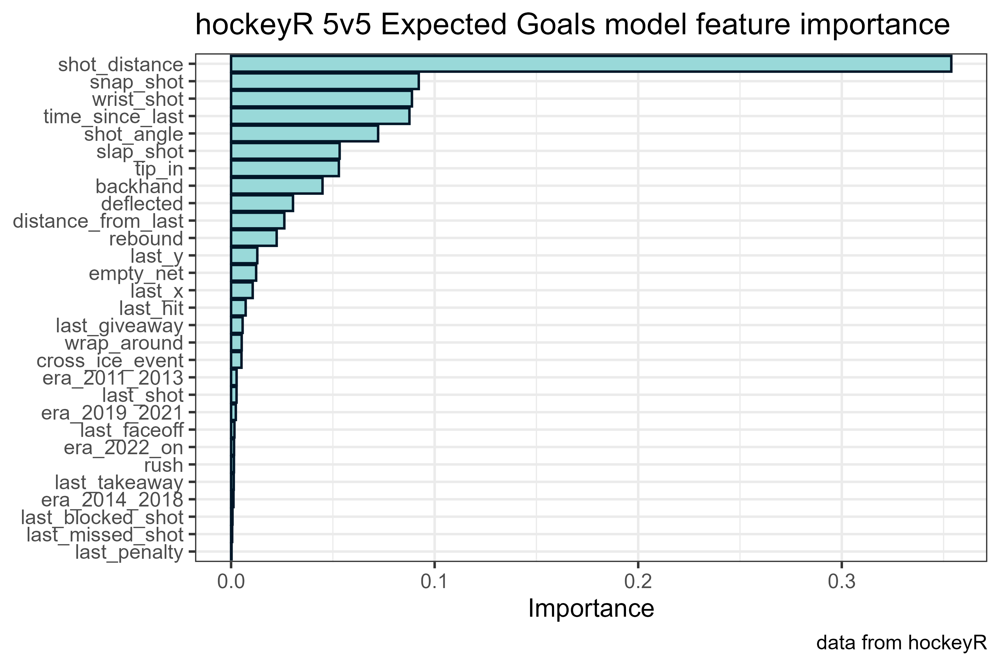
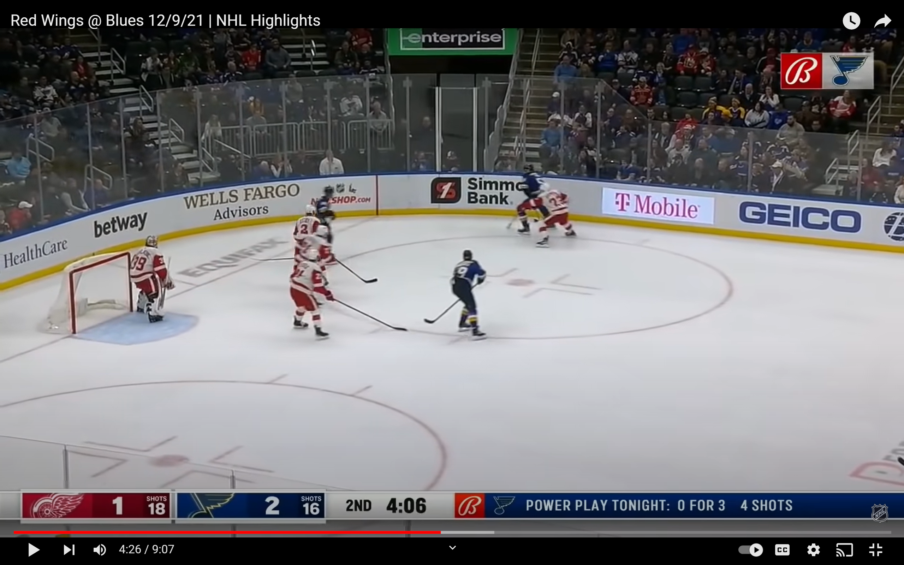
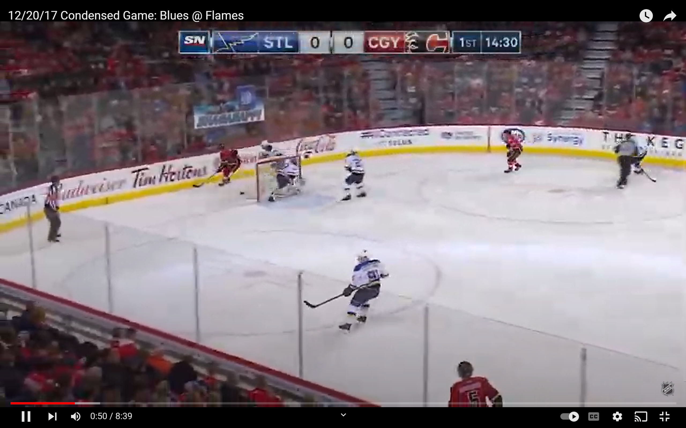
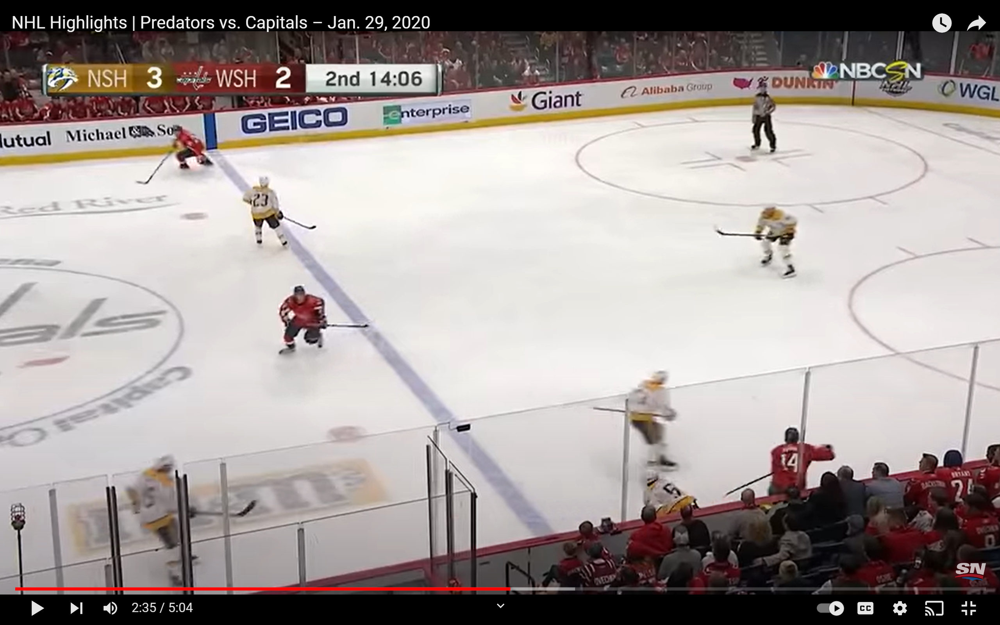
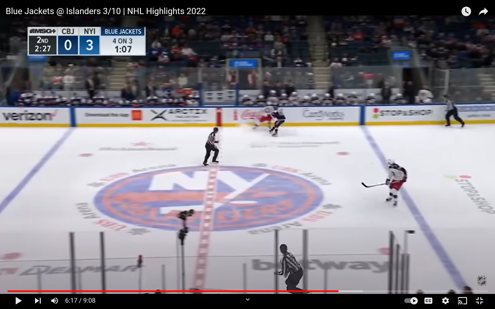

```{r setup, include=FALSE}
knitr::opts_chunk$set(echo = TRUE)
```

## hockeyR models

This is the home of the [`hockeyR`](https://github.com/danmorse314/hockeyR) expected goals model. Using the data available through the `hockeyR` R package, a completely public expected goals model was constructed. This model follows in the footsteps of *several* models before it, with a few significant tweaks of its own. Links to those models and how they were derived are referenced throughout this piece -- this model was influenced by each and every one of those, and owes a great deal of credit to their authors for making them public. This article will break down how the `hockeyR` model was constructed, what its main features are, and how well it performs compared to actual goals scored in the NHL.

```{r setting-up, results='hide', warning=FALSE, message=FALSE}
library(tidyverse)
library(hockeyR)
library(dtplyr)

# load play-by-play 
pbp_all <- load_pbp(season = 2011:2022)

# for dtplyr manipulation
pbp <- lazy_dt(pbp_all)

# define shot types used in model
fenwick <- c("SHOT","MISSED_SHOT","GOAL")
```

## Investigating the data

Before the model can be created, it's important to check that the data being used has as few errors as possible. One of the most basic things to check is the strength state of goals scored -- occasionally an error in the NHL shift reports implies an oddball strength state in the play-by-play data, such as a 3-on-0 or even a 7-on-5 goal.

```{r strength-state-checks}
# these are the true strengths one would find in a game
# any others are likely an error in the reported data
real_strengths <- c(
  "5v5","5v4","5v3","6v5","6v4","6v3","4v3","3v3",
  "4v4","4v5","3v5","5v6","4v6","3v6","3v4"
  )

# check what strengths the goals were scored at
chart <- pbp |>
  #remove shootouts
  filter((period < 5 & season_type == "R") | season_type == "P") |>
  # remove penalty shots
  filter(str_detect(secondary_type, "PS -", negate = TRUE)) |>
  # only checking goals
  filter(event_type == "GOAL") |>
  # combine like strengths (ie 5v4 = 4v5)
  separate(strength_state, into = c("event_team_skaters","opp_skaters"), sep = "v") |>
  mutate(
    event_team_skaters = as.integer(event_team_skaters),
    opp_skaters = as.integer(opp_skaters),
    max_skaters = ifelse(event_team_skaters > opp_skaters, event_team_skaters, opp_skaters),
    min_skaters = ifelse(event_team_skaters < opp_skaters, event_team_skaters, opp_skaters),
    strength_state = paste0(
      max_skaters,"v", min_skaters
      )
  ) |>
  group_by(strength_state) |>
  summarise(
    goals = n()
  ) |>
  ungroup() |>
  mutate(real = ifelse(strength_state %in% real_strengths, 1, 0)) |>
  arrange(-real, -goals) |>
  as_tibble()

total_goals <- sum(chart$goals)

chart <- chart |>
  mutate(
    goal_share = round(100*goals / total_goals,1),
    cum_goal_share = cumsum(goal_share)
    )

```

```{r strength-check-table, echo = FALSE, fig.alt="While there are some incorrect strength states listed in the raw data, more than 99% of goals in the hockeyR database are counted at a real strength state."}
seasons <- glue::glue("{min(as.numeric(pbp_all$season))} and {max(as.numeric(pbp_all$season))}")
total_goals <- sum(chart$goals)
good_goals <- sum(filter(chart, real == 1)$goals)
bad_goals <- sum(filter(chart, real == 0)$goals)

chart |>
  select(-real) |>
  DT::datatable(
    colnames = c(
      "Strength","Goals Scored","% of Total Goals","Cumulative % of Total Goals"
      ),
    rownames = FALSE,
    options = list(
      ordering = FALSE, pageLength = -1, dom = "t",
      columnDefs = list(list(className = 'dt-center', targets = 0:3))
      )
  )

glue::glue("Of {total_goals} scored in the NHL between {seasons}, {bad_goals} were counted at an incorrect strength state ({round(100*bad_goals/total_goals,3)}%)")
```

There were a few goals scored in a wonky strength state, but the overwhelming majority are in a standard 5-on-5 or special teams state. For this model, those scored incorrectly were simply removed from the training data. There were also a few shots that were missing certain features, such as the x-y location the shot was taken from or the type of shot taken -- these also proved to be minimal and were removed from the training data as well. Lastly, while blocked shots are recorded in the NHL play-by-play data, the location assigned to these shots is the location of the block, not the shooter. Therefore, only unblocked shots will be used here.[^1] Penalty shots and shootouts were also removed, as they are such a significantly different and rare play. Shootouts are not assigned an expected goals value, as they don't count as an official goal by the NHL anyway. Penalty shots were all simply assigned an expected goal value of \~0.32, reflecting the \~32% conversion probability of all penalty shot and shootout attempts over the past 12 seasons.

[^1]: Unblocked shots are also often referred to as "Fenwick," named after Matt Fenwick, who proposed that blocked shots are far worse scoring chances than unblocked shots, and don't add anything to analysis. Read more [here](https://www.pensionplanpuppets.com/2012/7/25/3184137/intro-to-advanced-hockey-statistics-fenwick).

## Feature Selection

This is where the key differences lie in most expected goals models, and this one is no different. There are some fantastic models in the public sphere with readily-available details on their features and importance. To name a few:

-   Asmae Toumi and Dawson Sprigings created an [even-strength model](https://hockey-graphs.com/2015/10/01/expected-goals-are-a-better-predictor-of-future-scoring-than-corsi-goals/) with identifiers for rush chances and rebounds, as well as whether the shooter was shooting from his off-wing. [@hockey-graphs-xg]

-   Matthew Barlowe's [public model](https://rstudio-pubs-static.s3.amazonaws.com/311470_f6e88d4842da46e9941cc6547405a051.html) is for all strengths, and takes the shooter's team strength as a variable. [@barlowe-xg]

-   Peter Tanner's [MoneyPuck.com](https://moneypuck.com/) [model utilizes information](https://moneypuck.com/about.htm) from the events immediately prior to the shot. [@moneypuck-xg]

-   Josh and Luke Younggren of [evolving-hockey.com](https://evolving-hockey.com/) made [four separate models](https://rpubs.com/evolvingwild/395136/) -- even strength, power play, shorthanded, and shooting on an empty net. [@evolving-wild-xg]

All models tend to agree that the most important feature in an expected goals model is far and away the distance between the shooter and the net, with the angle between shooter and net generally not far behind. For this model, the features used aren't significantly different from those listed above. There's distance and angle, as well as rebound and rush chance classifiers and information about the event immediately prior to the shot. The `hockeyR` model also includes an identifier called `cross_ice_event` to note if the shot takes place on the opposite East-West side of the ice as the previous event in order to account for whether the goaltender had to move laterally across the crease to make the save.

The most significant departure in the `hockeyR` model, though, comes in how it accounts for strength states. It follows a bit in the footsteps of the Younggrens, in that it is split into multiple models. The `hockeyR` expected goals model consists of two separate models: one exclusively for 5-on-5 play, and another for all other situations, which for the ease of this writing will henceforth be referred to as the special teams model. The key difference here is that shots previously considered even strength (4-on-4 and 3-on-3) are now excluded from the 5-on-5 model and instead incorporated into the special teams model. The decision behind this comes from the fact that a) so much of a hockey game is played at 5-on-5 that it's logical to have a model dedicated to it entirely, and b) the style of play in those "smaller" even strengths often resembles a special teams situation far more that they resemble 5-on-5 play.[^2]

[^2]: Author's note: I consulted with my brother, Jeremy Morse, on this decision, as he is someone who has actually *played the game*, as they say, and he agreed -- playing a shift at 4-on-4 and especially 3-on-3 left much more room on the ice to carry the puck and set up a better scoring chance than the chaos that often encompasses 5-on-5 play.

Consider that a go-to line for a commentator during a game when it enters a 4-on-4 or 3-on-3 state -- so often they will remark upon "how much room there is on the ice" now, which is considered to be a benefit to the faster skaters on the ice. And in fact that's true, there is more room out there, allowing for longer puck possessions by a single skater and fewer battles down low in the corners. What this leads to is a noticeably higher shooting percentage at these other strengths than is seen at 5-on-5 -- one that is more akin to a power play or a shorthanded chance than a 5-on-5 chance.

```{r goals-by-strength, fig.alt="NHL shooting percentages vary significantly by strength state. 4-on-4 and 3-on-3 strength states more closely resemble power play and shorthanded shooting percentages, respectively."}
strength_goals <- pbp |>
  filter(strength_state %in% real_strengths & event_type %in% fenwick) |>
  # toss out shooting on an empty net for this
  filter(str_detect(strength_state, "v6", negate = TRUE) & strength_state != "6v3") |>
  group_by(strength_state) |>
  summarise(
    sog = sum(event_type %in% c("SHOT","GOAL")),
    goals = sum(event_type == "GOAL"),
    .groups = "drop"
  ) |>
  mutate(
    sh_perc = round(100*goals / sog,2),
    strength = case_when(
      # default strength considerations
      strength_state %in% c("5v5","4v4","3v3") ~ "Even Strength",
      strength_state %in% c("3v4","3v5","4v5","4v6") ~ "Shorthanded",
      strength_state %in% c("5v4","5v3","4v3","6v4") ~ "Power play",
      TRUE ~ "Extra Attacker"
    )
  ) |>
  as_tibble()

strength_goals |>
  ggplot(aes(reorder(strength_state,-sh_perc), sh_perc)) +
  geom_col(aes(fill = strength)) +
  scale_fill_manual(values = c( "#E69F00", "#999999", "#56B4E9", "#009E73")) +
  theme_bw() +
    guides(fill = guide_legend(ncol = 2)) +
  theme(
    legend.background = element_rect(color = "black"),
    legend.position = c(.75,.75)
  ) +
  labs(
    x = NULL, y = "Shooting %", fill = NULL,
    caption = "data from hockeyR",
    title = "Shooting % by game strength state",
    subtitle = "2010-11 through 2021-22 NHL seasons"
  )
```

It should also be noted that the special teams model includes two new features to indicate the strength state. First is the `total_skaters_on` the ice (ie 6 for 3-on-3 play), which can be considered a proxy for the amount of "space" on the ice. Second is the `event_team_advantage`, which is the total number of skaters on the shooting team's side less the total skaters on the opposing side. For example, a power play shot at 5-on-3 would have a `total_skaters_on` value of 8 (5+3) and an `event_team_advantage` of 2 (5-3). A shorthanded chance at 4-on-3 would have a `total_skaters_on` value of 7 and an `event_team_advantage` of -1.

Lastly, both the 5-on-5 model and the special teams model also include an "era" feature. This is designed to account for the ever-changing goal-scoring rates in the NHL that can be influenced by things like rule changes and goalie pad size requirements. This idea was taken directly from the `nflfastR` [@nflfastR] package and its expected points model, which separates the data into [five separate eras](https://www.opensourcefootball.com/posts/2020-09-28-nflfastr-ep-wp-and-cp-models/#ep-model-features). Four eras were chosen for `hockeyR`, as follows:

-   2010-11 through 2012-13

-   2013-14 through 2017-18

-   2018-19 through 2020-21

-   2021-22 and beyond

These aren't completely arbitrary choices, but rather choices related to rule changes in the NHL. There was a [rule change in 2013](https://www.nhl.com/news/nhl-goalies-to-use-shorter-leg-pads-in-2013-14/c-680812) which reduced the length of a goaltender's leg pads. [In 2018, it was the goalies' chest and arm protectors](https://www.nhl.com/news/nhl-nhlpa-add-chest-arm-pad-rules-for-goalies/c-300172856) that were reduced by the NHL. And beginning in 2021-22, the [NHL put an emphasis on calling more cross-checking penalties](https://twitter.com/PR_NHL/status/1441493080637689859?s=20&t=_m88Ii6wtIUvUIy3NL446w), making it more difficult for defenders to clear out forwards in front of the net.

[Patrick Bacon's expected goals model](https://topdownhockey.medium.com/a-new-expected-goal-model-that-is-better-than-corsi-at-predicting-future-goals-ecfa44dc84e9) [@topdownhockey-xg] also accounts for these rule changes, but rather than including an era as a model feature, Bacon chose to train models for each season on smaller data sets near the season in question in order to account for changes in rules and goal scoring.

Once the final model was trained and tuned (more details in the next section) it was possible to generate a feature importance plot. As with every other model mentioned above, the distance from the shooter to the net was the biggest factor in deciding whether or not a shot would become a goal.

{alt="Shot distance is the most important feature in the hockeyR expected goals model, followed by shot type, time elapsed since last event, and shot angle"}

## Model Building and Tuning

This article won't go through the fine details of building the model. For those interested in seeing precisely how they were built, the complete details and code used to construct the models can be found in the `R/build_xg_model.R` file in this repository. This model was built with an extreme gradient boosting algorithm using the R package `xgboost` [@xgboost]. XGBoost models are considered to be highly predictive but not very interpretable under the hood. Rachael Tatman provides a great overview of how these models work and how to build one [here](https://www.kaggle.com/code/rtatman/machine-learning-with-xgboost-in-r/notebook). [@xgboost-tutorial]

The 12 seasons of data were randomly split into a training set and a testing set. This differs from most other models, which usually use the most recent season or two as the holdout test sets. The reasoning behind this was to ensure the era adjustment properly captured how many goals were being scored in the most recent seasons. The sets were split such that all plays from any given game were in the same set -- there isn't a shot from one game in the training set and another shot from that same game in the testing set. This is to ensure there is no leakage into the training set, as information about the previous plays is included as a model feature.

A modified random grid search was used to tune the hyperparameters with 5-fold cross validation. This process is quite computing-intensive and could potentially be improved, but the final model looks pretty good already with the parameters chosen. Most XGBoost models use either the log-loss or the Area Under the Curve (AUC) to evaluate how well the model performs. Here's how the `hockeyR` model performs according to those two metrics:

| Model | CV Log-loss | CV AUC | Test Set Log-loss | Test Set AUC |
|:-----:|:-----------:|:------:|:-----------------:|:------------:|
|  5v5  |   0.1724    | 0.8408 |      0.1690       |    0.8438    |
|  ST   |   0.2332    | 0.8323 |      0.2320       |    0.8317    |

Both log-loss and AUC will be between 0 and 1, with a *lower* log-loss being better and a *higher* AUC being better. Guarav Dembla provides great resources on how to intuitively interpret these numbers [here](https://towardsdatascience.com/intuition-behind-log-loss-score-4e0c9979680a) [@logloss-intro] and [here](https://towardsdatascience.com/intuition-behind-roc-auc-score-1456439d1f30) [@auc-intro].

## Results

With the models finalized, they can now be applied to every season in the `hockeyR` database, assigning an expected goals value to every unblocked shot in the play-by-play data. From there, it's possible to investigate the number of goals scored by individual players and compare that to the total expected goals accumulated by the player on their unblocked shots. As it turns out, the relationship between player-level expected goals and their actual goals scored is pretty good.

```{r player-xg-plot, message=FALSE, fig.alt="Player-level goal scoring is highly correlated with player-level expected goals"}

player_goals <- pbp |>
  filter(season_type == "R" & period < 5) |>
  filter(event_type %in% fenwick) |>
  group_by(player = event_player_1_name, season) |>
  summarise(
    fenwick = n(),
    goals = sum(event_type == "GOAL", na.rm = TRUE),
    xg = sum(xg, na.rm = TRUE),
    .groups = "drop"
  ) |>
  mutate(gax = goals - xg) |>
  # let's remove all skaters without a goal
  filter(goals > 0) |>
  as_tibble()

goal_mod <- lm(goals ~ xg, data = player_goals)

rsq_player <- summary(goal_mod)$r.sq |> round(3)

player_goals |>
  ggplot(aes(xg, goals)) +
  geom_abline(slope = 1, intercept = 0, linetype = "dashed") +
  geom_point(alpha = .2) +
  geom_smooth(method = lm, color = "red", se = TRUE) +
  geom_text(aes(x = 3, y = 22, label = paste("r^2:",rsq_player)),
            color = "red") +
  scale_x_continuous(breaks = seq(0,60,10)) +
  scale_y_continuous(breaks = seq(0,60,10)) +
  theme_bw() +
  labs(
    x = "Expected Goals", y = "Observed Goals",
    caption = "data from hockeyR",
    title = "Player season goal totals vs expectation",
    subtitle = "2010-11 through 2021-22 seasons | all situations"
  )
```

Performing the same analysis at the team-level yields not quite as strong of a correlation, but still very encouraging results.

```{r team-xg-plot, message=FALSE, fig.alt="Team-level goal scoring is highly correlated with team-level expected goals, though not quite as well as at the player-level"}

team_goals <- pbp |>
  filter(season_type == "R" & period < 5) |>
  filter(event_type %in% fenwick) |>
  group_by(team = event_team_abbr, season) |>
  summarise(
    fenwick = n(),
    goals = sum(event_type == "GOAL", na.rm = TRUE),
    xg = sum(xg, na.rm = TRUE),
    .groups = "drop"
  ) |>
  mutate(gax = goals - xg) |>
  as_tibble()

team_goal_mod <- lm(goals ~ xg, data = team_goals)

rsq_team <- summary(team_goal_mod)$r.sq |> round(3)

team_goals |>
  ggplot(aes(xg, goals)) +
  geom_abline(slope = 1, intercept = 0, linetype = "dashed") +
  geom_point(alpha = .2) +
  geom_smooth(method = lm, color = "red", se = TRUE) +
  geom_text(aes(x = 150, y = 200, label = paste("r^2:",rsq_team)),
            color = "red") +
    scale_x_continuous(breaks = seq(0,60,10)) +
  scale_y_continuous(breaks = seq(0,60,10)) +
  theme_bw() +
  labs(
    x = "Expected Goals", y = "Observed Goals",
    caption = "data from hockeyR",
    title = "Team season goal totals vs expectation",
    subtitle = "2010-11 through 2021-22 seasons | all situations"
  )
```

Borrowing again from `nflfastR` (and more originally, `nflscrapr` [@Yurko2018]), a calibration plot can be created to see how well the model matches up with actual goals scored across different levels of goal probability.

```{r xg-calibration-plot, message=FALSE, warning=FALSE, fig.alt="The expected goals model performs very well when predicting low-danger shots, but tends to undervalue high danger shots a little relative to actual goal scoring"}

xg_bin_plot <- pbp |>
  filter(!is.na(xg) & event_type %in% fenwick) |>
  filter(season_type == "R" & period < 5) |>
  mutate(xg_bin = round(xg / 0.05) * 0.05) |>
  group_by(xg_bin) |>
  summarise(
    fenwick = n(),
    goals = sum(event_type == "GOAL"),
    .groups = "drop"
  ) |>
  mutate(obs_goal_prob = goals / fenwick) |>
  as_tibble()

xg_bin_plot |>
  ggplot(aes(xg_bin,obs_goal_prob)) +
  geom_abline(slope = 1, intercept = 0, linetype = "dashed") +
  geom_point(aes(size = fenwick)) +
  scale_size_continuous(
    breaks = c(10000,20000,40000,60000,80000),
    labels = c("10k","20k","40k","60k","80k")
    ) +
  geom_smooth() +
  coord_equal() +
  scale_x_continuous(limits = c(0,1)) +
  scale_y_continuous(limits = c(0,1)) +
  theme_bw() +
  labs(
    x = "Estimated goal probability", y = "Observed goal probability",
    caption = "data from hockeyR", size = "Unblocked\nShots",
    subtitle = "2010-11 through 2021-22 seasons | all situations",
    title = "xG Calibration"
  )
```

This plot shows the limitations of `hockeyR` expected goals. Once a scoring chance gets above about a 50% chance of becoming a goal, the model tends to underestimate the likelihood that the shot will become a goal. The observed goal probabilities are essentially 100% once the model gets past about an 90% expected goal probability.

Borrowing again from Bacon, checking to see if the total expected goal count for each season is near the total observed goal count for each season shows that the model generally under-counts the goal totals in recent seasons, but not by too much. Over the twelve seasons in total, there's on average 0.993 expected goals per observed goal scored.

```{r xg-per-g}

pbp |>
  # remove shootouts and penalty shots
  filter(season_type == "R" & period < 5) |>
  group_by(season) |>
  summarise(
    goals = sum(event_type == "GOAL"),
    xg = sum(xg, na.rm = TRUE),
    .groups = "drop"
  ) |>
  mutate(
    xg_per_g = round(xg / goals,3),
    xg = round(xg, 1)
  ) |>
  select(season, goals, xg, xg_per_g) |>
  as_tibble() |>
  DT::datatable(
    colnames = c("Season","Goals","xG","xG per Goal"),
    rownames = FALSE,
    options = list(
      ordering = FALSE, pageLength = -1, dom = "t",
      columnDefs = list(list(className = 'dt-center', targets = 0:3))
      )
  )
```

## Individual Examples

```{r max-goals}
max_xg <- pbp |>
  filter(event_type == "GOAL") |>
  arrange(xg) |>
  slice(1:50) |>
  select(xg, description, event_type, strength_state, period, game_date, away_abbreviation, home_abbreviation) |>
  as_tibble()
```

One of the highest expected goal values last season according to the `hockeyR` model goes to Colton Parayko's tap-in against the Red Wings, at 0.84. The NHL recorded this shot as coming from 3 ft away from the net, though in actuality is was closer to 6 inches. The model also doesn't know the goalie's position and therefore doesn't know the shot was taken behind the goaltender, but it still gave it a satisfactorily high value.

[](https://youtu.be/tD4MGnqDAhY?t=264)

One of the highest expected goals value for a 5-on-5 shot that did *not* result in a goal is this whiff from Mark Jankowski in 2017, which had a whopping 0.86 expected goal value.

[](https://youtu.be/nWkOxvxFEAY?t=49)

On the flip side, one of the lowest expected goals values for any goal scored at 5-on-5 is this goal by Richard Panik, who gets the credit as the last player on the scoring team to touch the puck before Nick Bonino put it in his own net. The model gave it an expected goal value of 0.0005.

[](https://youtu.be/38U3s73xFIY?t=155)

Since the NHL doesn't count "own goals," this one is listed as being shot by Panik from just inside the blue line, all the way on the right wall -- a distance of 74.6 ft. out. That's where he last touched the puck, dumping it in behind the net prior to the goal. There's no real way to account for this with the way the play-by-play data records this type of event, but having a very low expected goal value for a very rare occurrence works out just fine.

One final example, here's a goal with an above-average, but not extreme, expected goal value.

[](https://youtu.be/SQfwN92Dk4Y?t=377)

```{r sample-goal, echo=FALSE}

model_feats <- c(
  "shot_distance","shot_angle",  "shot_type","rebound","rush",
  "last_event_type","time_since_last","distance_from_last",
  "cross_ice_event","empty_net","last_x","last_y",
  # era -- year grouping of event
  # target
  "goal"
  )

sample_play <- pbp_all |>
  filter(game_id == 2021020693) |>
  arrange(event_id) |>
  mutate(
    last_event_type = lag(event_type),
    last_event_team = lag(event_team),
    time_since_last = game_seconds - lag(game_seconds),
    last_x = lag(x),
    last_y = lag(y),
    distance_from_last = round(sqrt(((y - last_y)^2) + ((x - last_x)^2)),1),
    event_zone = case_when(
      x >= -25 & x <= 25 ~ "NZ",
      (x_fixed < -25 & event_team == home_name) |
        (x_fixed > 25 & event_team == away_name) ~ "DZ",
      (x_fixed > 25 & event_team == home_name) |
        (x_fixed < -25 & event_team == away_name) ~ "OZ"
    ),
    last_event_zone = lag(event_zone),
    event_team_skaters = ifelse(event_team == home_name, home_skaters, away_skaters),
    opponent_team_skaters = ifelse(event_team == home_name, away_skaters, home_skaters),
    total_skaters_on = event_team_skaters + opponent_team_skaters,
    rebound = ifelse(last_event_type %in% fenwick & time_since_last <= 2, 1, 0),
    rush = ifelse(last_event_zone %in% c("NZ","DZ") & time_since_last <= 4, 1, 0),
    cross_ice_event = ifelse(
      # indicates goalie had to move from one post to the other
      last_event_zone == "OZ" &
        ((lag(y) >  3 & y < -3) | (lag(y) < -3 & y > 3)) &
        # need some sort of time frame here to indicate shot was quick after goalie had to move
        time_since_last <= 2, 1, 0
    ),
    shot_type = secondary_type,
    goal = ifelse(event_type == "GOAL", 1, 0)
  ) |>
  filter(event_id == 20210206930483) |>
  select(xg, all_of(model_feats), everything())

sample_play |>
  mutate(xg = round(xg,2)) |>
  select(
    event = event_type, xg:shot_type, rush, last_event = last_event_type, distance_from_last, time_since_last, strength_state
  )
```

Jean-Gabriel Pageau scores here on a rush chance that followed a neutral zone giveaway by the Blue Jackets. The model doesn't have passing data and can't know that this was a one-timer off of a pass across the slot, but the rush chance identifier coupled with the shorthanded strength state is enough to push the expected value to an above-average number.

## References
